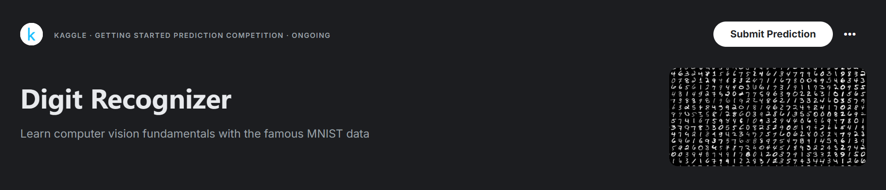
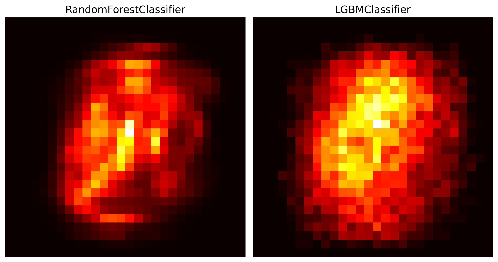

# Digit Recognizer 🔢 (数字识别器)

使用著名的 MNIST 数据学习计算机视觉基础知识

**❤️‍🔥纯属感兴趣的选择 <(￣︶￣)↗[GO!]**

## 竞争描述🎯

### MNIST

---

***MNIST***（ “修改后的国家标准与技术研究所” ）实际上是计算机视觉的 ***“你好”*** 数据集。

自 1999 年发布以来，这个经典的手写图像数据集一直作为基准分类算法的基础。

随着新的机器学习技术的出现，MNIST 仍然是研究人员和学习者的可靠资源。

### 目标

---

在这场比赛中，你的目标是从成千上万的手写图像数据集中 ***正确识别数字***。

我们 ***鼓励您尝试不同的算法***，以第一手了解哪些算法运行良好，以及如何比较技术。

## 数据集描述📑

数据文件 `train.csv` 和 `test.csv` 包含手绘数字的灰度图像，从 `0` 到 `9` 。

### 图像

---

每张图像高 `28` 像素，宽 `28` 像素， ***总共 `784` 像素*** 。

每个像素都有一个单独地像素值，表示该像素的亮度或暗度， ***数字越高表示越暗*** 。

该像素值是一个 ***介于 `0` 到 `255` 之间的整数***。

### 数据集

---

训练数据集（`train.csv`）有 `785` 列。

第一列称为 `“label”` ，是用户 ***绘制的数字*** 。

其余的列包含关联图像的像素值。

### 特征值

---

训练集中的每个像素列都有一个类似 `pixelx` 的名称，其中 `x` 是 `0` 到 `783` 之间的整数，包括 `0` 到 `783` 。

为了在图像上定位这个像素，假设我们将 `x` 分解为 `x = i * 28 + j` ，其中 `i` 和 `j` 是介于 `0` 到 `27` 之间的整数。

然后 `pixelx` 位于 `28 x 28` 矩阵的第 `i` 行和第 `j` 列，（索引为 `0`）。

## 使用模型🦜

1. 逻辑回归 `LogisticRegression`
2. 支持向量机 `SVC`
3. 随机森林 (Bagging) `RandomForestClassifier`
4. LightGBM (Boosting) `LGBMClassifier`
5. 投票 (Voting) `VotingClassifier`
6. 堆叠 (Stacking) `StackingClassifier`

（神经网络还未学习）

## 亮点发现💡

- ***随机森林像把重要性平均分给多个特征，红色更淡且分散；***

- ***LGBM像放大镜聚焦在关键特征上，红色更浓。***

---

### 通过 随机森林（分散热力） 与 LGBM（聚焦热力） 的对比：

---

直观展现了 `Bagging` 与 `Boosting` 集成方法的核心差异

>—— ***群体智慧优化稳定性 vs 迭代强化关键特征精准性***

这种差异为模型选择（**稳定性优先** 或 **特征解释性优先**）及特征工程优化方向提供了直接判据。

### 直白地讲：

---

两种机器学习模型（随机森林 和 LGBM）做决策时是有 **"关注点"** 的差异的。

>左边的 **随机森林** 像很多人投票，每个特征都有点用，***结果更稳定但不够精准***；

>右边的 **LGBM** 像学霸专攻重点，能快速抓住最关键的特征，***判断更精准但容易钻牛角尖***。

## 学习总结📚

### 模型对比

---

- ***图像处理的利器是神经网络*** ，而这些机器学习算法虽然也可以进行图像的多分类任务，但相较于神经网络有一定的差距。
- MNIST 数据集的图像数量为 (42000, 28, 28) 属于大数据量，传统机器学习算法所需运行时间长。这也使得项目推进缓慢且效果一般，因此 ***边际效益高*** 。

---

|    名称    |            函数            |    最高得分     |      对比      |
|:--------:|:------------------------:|:-----------:|:------------:|
|   逻辑回归   |   `LogisticRegression`   |   0.91985   |  数据需要标准化和降维  |
|  支持向量机   |          `SVC`           |   0.96432   |  数据需要标准化和降维  |
|   随机森林   | `RandomForestClassifier` |   0.96396   |  树模型，对数值不敏感  |
| LightGBM |     `LGBMClassifier`     |   0.97392   |  树模型，对数值不敏感  |
|    投票    |    `VotingClassifier`    |   0.97660   | 取长补短，但边际效益较高 |
|    堆叠    |   `StackingClassifier`   | **0.97903** | 取长补短，但边际效益较高 |

### 😸杂谈

---

虽然未学习深度学习的相关知识，但在 ❤️‍🔥***兴趣使然下***，我还是运用目前所掌握的知识尝试了该项目。

---

在本次学习的过程中，最有趣的地方莫过于 Kaggle 排名 🐌***蜗牛一般的缓慢攀爬速度了 :)*** 。

作为一个刚刚爬完 Titanic 的 ***纯机器学习新手*** ，这实在让人无可奈何的笑了！

只能说 🚢***Titanic 确实该沉*** ，它💧是真多啊：

- 如果您也做过这个项目，您可能也觉得它 ***该沉*** 。
- 如果您未做过这个项目，那么它可以给你一种 ***降维打击的快乐*** 。

---

回到本项目，除了排名的有趣，也存在着一些 🪖***挑战*** ：

- 首当其冲的就是 ***数据集 MNIST 的庞大*** （我至今做过的最大数据量）
- 然后就是庞大数据集带来 ***运行时间的指数级增长*** （我就一 `Inter Core i5-12500H` 笔记本，能当电风扇了）
- 因此我放弃了（随机）网格搜索，只能挑战 ***手动搜索加运气*** 😣，因此我所得出的最优可能不是真正的最优（可能真正最优能够到达 0.98 以上）

---

**收获：**

- 了解了使用 `PCA` 配合 `StandardScaler` 进行数据降维
- 更加熟练地使用了 ***逻辑回归、支持向量机、随机森林、投票、堆叠***
- 基本学会了 ***LightGBM 的使用*** （AdaBoost 和 GradientBoost 并不好用）
- 对比了 ***随机森林 与 LightGBM 的特征重要性的不同*** （对比图是真漂亮！）

---

🎯***完事收工！去学深度学习去了！<(￣︶￣)↗[GO!]***

## 资源链接🪢

1. [Kaggle](https://www.kaggle.com/code/galaxyo1/no-neural-network-0-97903)
2. [GitHub](https://github.com/Themilkyway01/No-neural-network-0.97903)
3. [GitCode](https://gitcode.com/Galaxy_zero/No-neural-networ-0.97903)
4. [CSDN](https://blog.csdn.net/Galaxy_zero/article/details/147271478)

**数据集：**[Data](https://www.kaggle.com/competitions/digit-recognizer/data)
